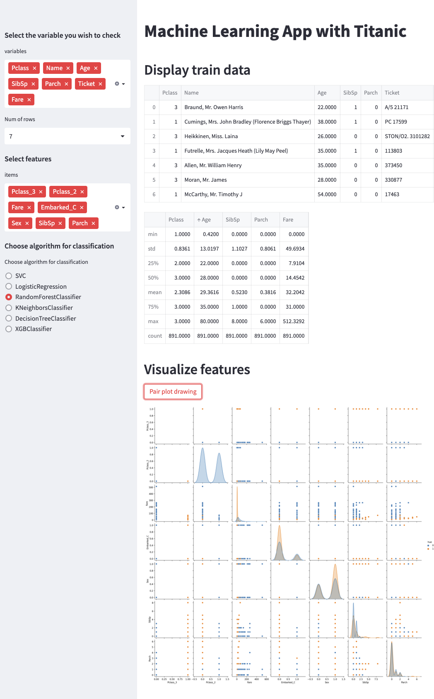

# Machine Learning Web App with Titanic

## Overview
With this web app, you can learn about machine learning using the Titanic dataset. You can view the training data, visualize it, and use machine learning to make predictions.
### Display trian data
You can view the raw data and basic statistics of selected features by specifying the number of rows to view in the 'num of rows' field. Choose the features you want to analyze from the sidebar.
### Visualize features
You can create a pair plot for several features of your choice by selecting them from the sidebar.
### Prediction
Select a prediction algorithm from the sidebar. You can then view the training and test scores of the simple model, and determine how well the model is fitting the training data.
## Discroption Demo

## Planned additional Features
* Ability to modify the hyperparameter values for each algorithm
* View the contribution of each feature in the model
* Save created predictions to a database for ensemble modeling
